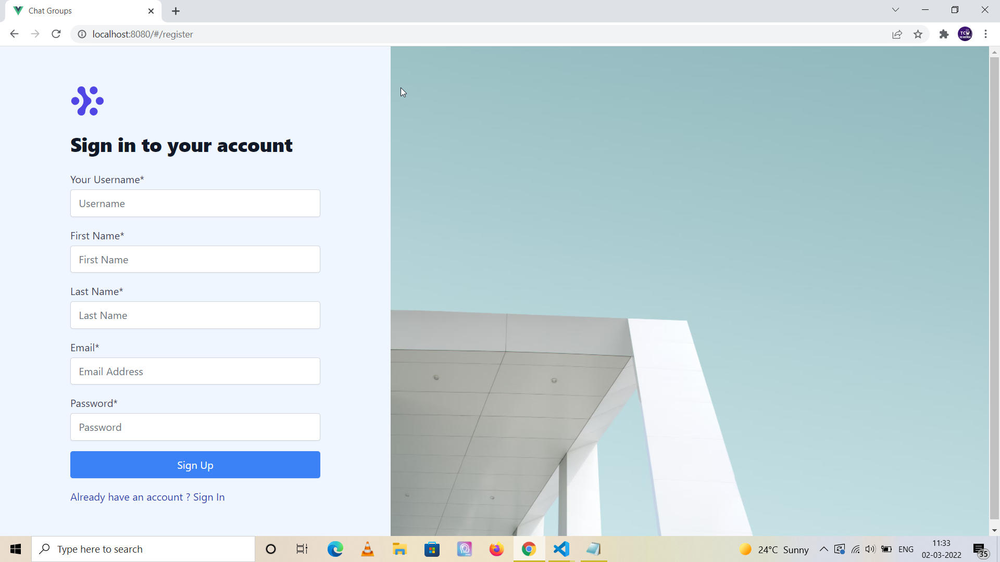

# Chat Groups using Express, Vue, Socket IO, MongoDB, Tailwind CSS and Vuex


## Project Briefing

This is a multi-user authentication based group chat application. Users can sign-in to the system and start chatting by creating groups, joining existing groups. The user would have authority to perform CRUD operations on the groups they created.

## Built With

* [Express](https://expressjs.com/)
* [Socket IO](https://socket.io/)
* [Vue](https://vuejs.org/)
* [MongoDB](https://www.mongodb.com/)
* [Vuex](https://vuex.vuejs.org/)
* [Tailwind CSS](https://tailwindcss.com/)

## Authors

* **Amit Prafulla (APFirebolt)** - (http://amitprafull.com/)

## Project setup

Simply install node modules for both frontend and backend, the project is already configured to serve build content files in production which is generated by Vue which resides inside the build folder.

Concurrently, package is used for development and allows us to launch both frontend and back-end in one go using single command. Proxy is used for API calls made to the Express server inside the Vue application using the config file.

```
npm install
npm run dev
```

For production, build the frontend of the app and then run the backend app only. 

```
npm run build
npm start
```

## Project Updates

- Expect constant updates in terms of UI of the project which is still in development phase.
- Enhancement like ability to invite users to a chat group can be added later.

## Project Screenshots

Please find some of the screenshots of the application. Screenshots of only those pages are included as of now which are not 
very likely to change in future. Below is the screenshot of the sign-up page which is likely to be changed slightly



This page shows list of chat rooms with details like who created it and when was it created. Day js is used for date filtering.


Chat detail page.

